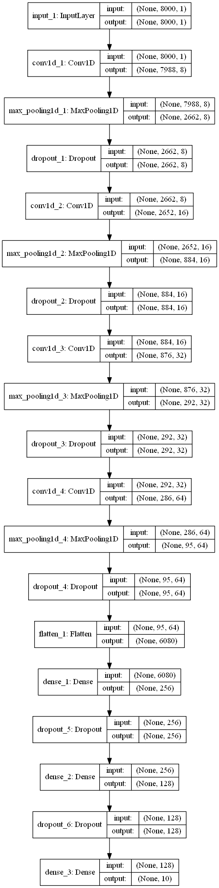

# voice-command-classification-Keras
command classification using Keras

### Dataset:
TensorFlow has released the Speech Commands Datasets. It includes 65,000 one-second long utterances of 30 short words, by thousands of different people. We’ll build a speech recognition system that understands simple spoken commands.

You can download the dataset from :https://www.kaggle.com/c/tensorflow-speech-recognition-challenge

### Model:

The model consists of Conv1d layers followed by maxpooling layer. Also dropout is used as the regularization method.

